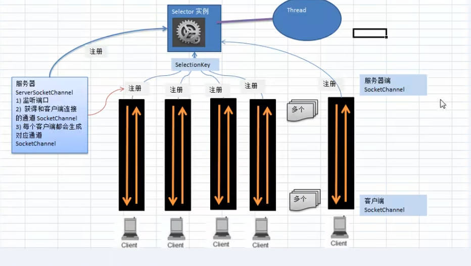
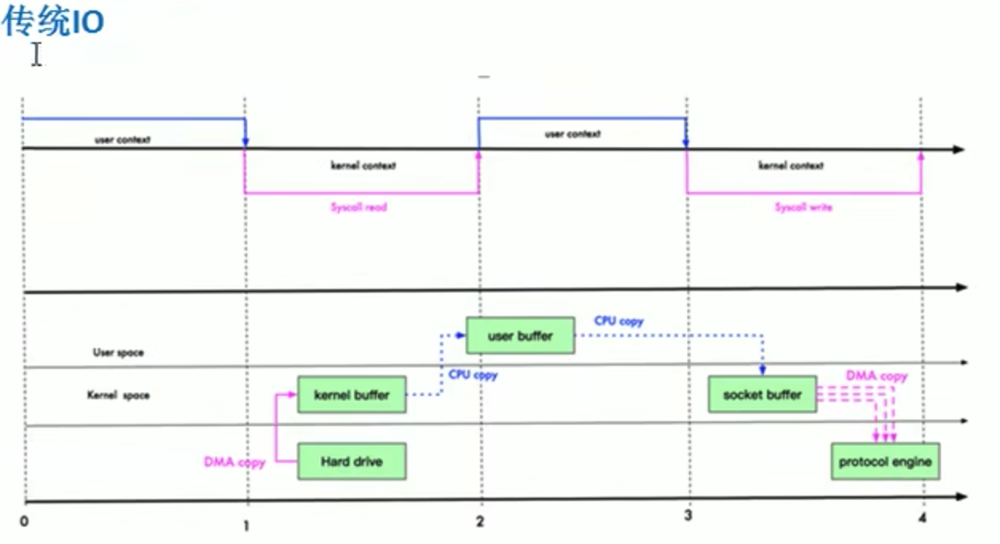
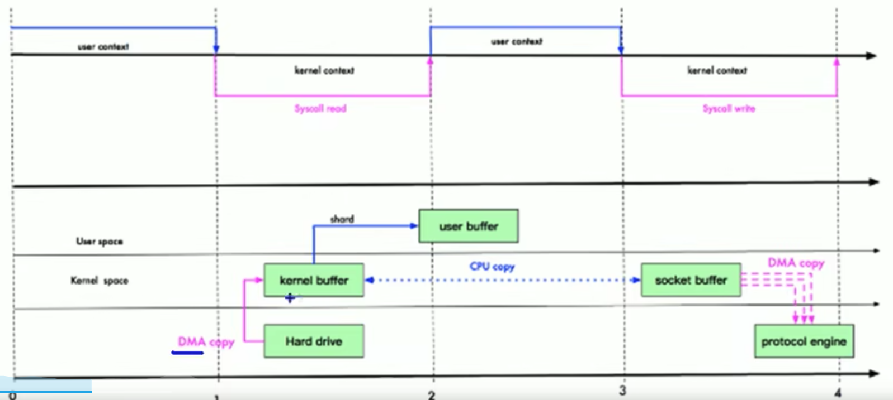
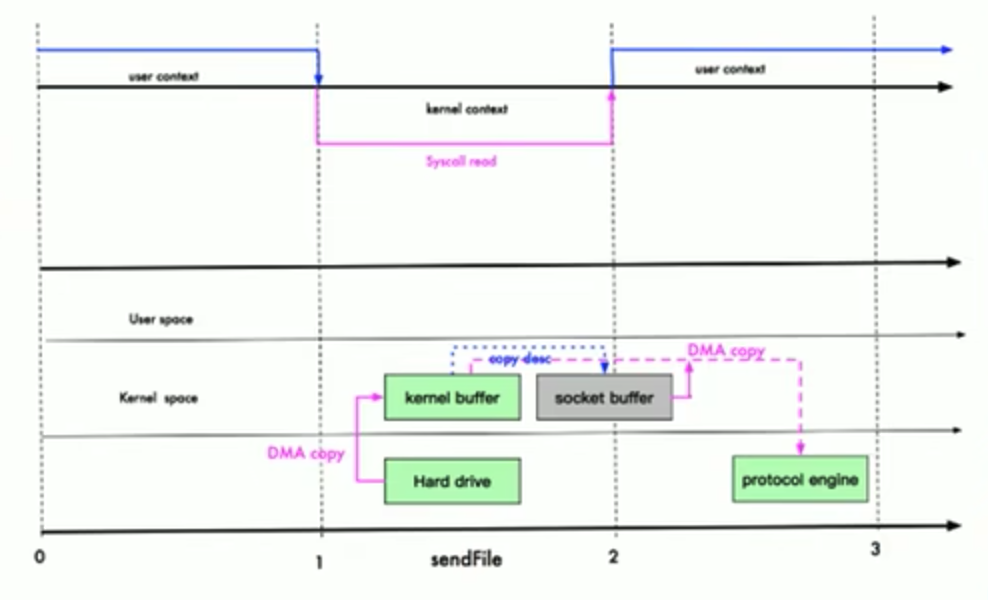
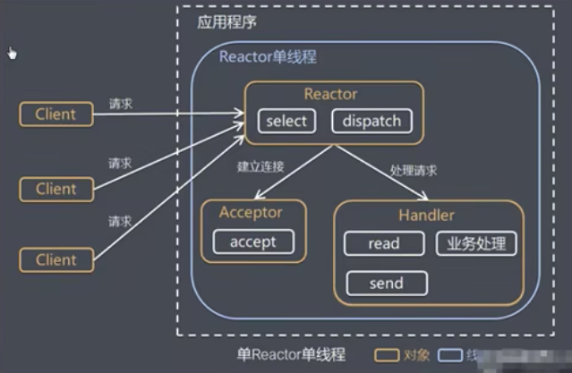
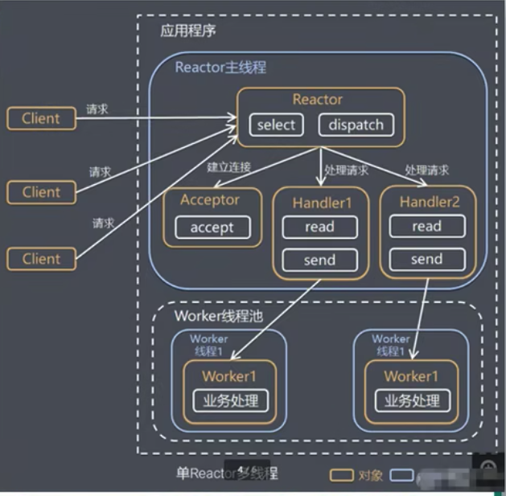
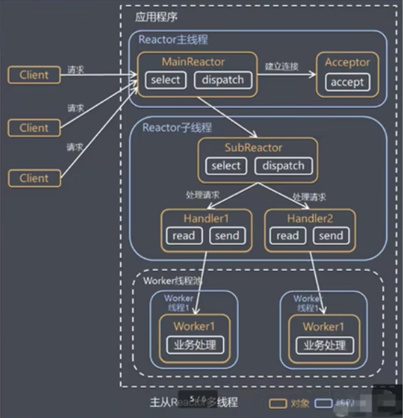
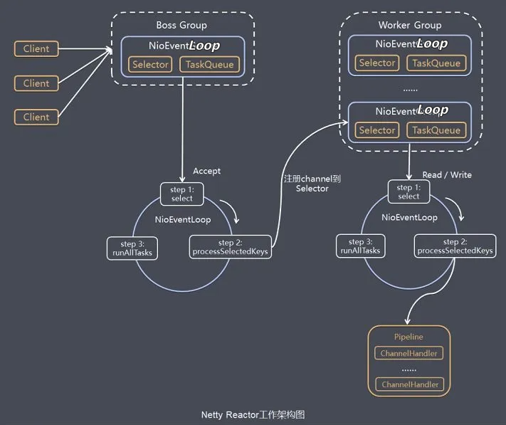

# BIO问题分析
* 每一个请求都需要创建独立的线程，与对应的客户端进行数据Read，业务处理，数据Write
* 当并发数较大时，需要创建大量线程来处理连接，系统资源占用较大
* 连接建立后，如果当前线程暂时没有数据可读，则线程就阻塞在Read操作上，造成线程资源浪费
# NIO与BIO的
1. BIO以流的方式处理数据，而NIO以块的方式处理数据，块IO的效率比流IO高很多
2. BIO是阻塞的，NIO则是非阻塞的
3. BIO基于字节流和字符流进行操作，而NIO基于Channel（通过）和Buffer（缓冲区）进行操作，数据总是从通道读取到缓冲区中，或者从缓冲区写入到通道中。Selector（选择器）用于监听多个通道的事件（比如：连接请求，数据到达等），因此使用单个线程就可以监听多个客户端通道。
# NIO非阻塞网络编程原理分析图
NIO非阻塞网络编程相关的（Selector、SelectionKey、ServerSocketChannel和SocketChannel）关系梳理图

## 原理图说明
1. 当客户端连接时，会通过ServerSocketChannel得到SocketChannel
2. Selector使用select方法进行监听，返回有事件发生的通道的个数
3. 将socketChannel注册到Selector上，register(Selector sel, int ops),一个selector上可以注册多个SocketChannel
4. 注册后返回一个SelectionKey，会和该Selector关联（集合）
5. 进一步得到各个SelectionKey（有事件发生）
6. 再通过SelectionKey的channel方法反向获取SocketChannel
7. 可以通过得到的channel完成业务处理
# NIO与零拷贝
传统IO经过4次拷贝，3次状态切换：磁盘 -> 内核 -> 用户 -> 内核 -> 协议栈；内核态 -> 用户态 -> 内核态

* 我们说的零拷贝，是从操作系统的角度来说的。因为内核缓冲区之间没有数据是重复的（只有kernel buffer有一份数据），内核缓冲区之间的数据拷贝是通过CPU拷贝的
* 零拷贝不仅仅带来更少的数据复制，还能带来其他的性能优势，例如更少的上下文切换，更少的CPU缓存微共享以及无CPU校验和计算。
## mmap（内存映射）

* mmap通过内存映射，将文件映射到内核缓冲区，同时，用户可以共享内核空间的数据。这样，在进行网络传输时，就可以减少内核空间到用户空间的拷贝次数。
* 适合小数据量读写
* 需要3次上下文切换，3次数据拷贝

## sendFile
* linux2.1版本提供了sendFile函数，其基本原理如下：
  * 数据根本不用经过用户态，直接从内核缓冲区进入到SocketBuffer，同时，由于和用户态完全无关，就减少了一次上下文切换
    
    
* linux2.4版本中，做了一些优化，避免了从内核缓冲区拷贝到Socket buffer操作，直接拷贝到协议栈，从而再一次减少了数据拷贝
  * 这里其实还是有一次CPU拷贝kernel buffer -> socket buffer 但是拷贝的信息很少，比如length、offset消耗低，可以忽略
    * 
* 适合大文件传输
* 需要2次上下文切换，最少2次数据拷贝
* 可以利用DMA（direct memory access:直接内存拷贝不使用CPU）方式，减少CPU拷贝，mmap则不能（必须从内核拷贝到Socket缓冲区）
# Netty
## 线程模型
* 目前存在的线程模型有：
  1. 传统阻塞I/O服务模型
  2. Reactor模型
* 根据Reactor的数量和处理资源池线程的数量不同，有3种典型的实现
  * 单Reactor单线程
    * 
    * 优点：编码简单、清晰明了
    * 缺点：如果客户端连接数量较多，将无法支撑，前面的NIO案例就属于这种模型
  * 单Reactor多线程
    * 
    * 优点：可以充分利用多核CPU的处理能力
    * 缺点：多线程数据共享和访问比较复杂，reactor处理所有的事件的监听和响应，在单线程运行，在高并发场景容易出现性能瓶颈。
  * 主从Reactor多线程
    * 
    * 优点：父线程与子线程的数据交互简单职责明确，父线程只需要接收新连接，子线程完成后续的业务处理
    * 缺点：编程复杂度较高
* Netty线程模型（netty主要基于主从Reactor多线程模型做了一定的改进，其中主从Reactor多线程模型有多个Reactor）
## netty架构图

1. Netty抽象出两组线程池BossGroup专门负责接收客户端的连接，WorkerGroup专门负责网络的读写
2. BossGroup和WorkerGroup类型都是NioEventLoopGroup
3. NioEventLoopGroup相当于一个事件循环组，这个组中含有多个事件循环，每个事件循环就是NioEventLoop
4. NioEventLoop表示一个不断循环的执行处理任务的线程，每个NioEventLoop都有一个selector，用于监听绑定在其上socket的网络通信
5. NioEventLoopGroup可以有多个线程，即可以含有多个NioEventLoop
6. 每个Boss NioEventLoop执行的步骤有3步：
    1. 轮询accept事件
    2. 处理accept事件，与client建立连接，生成NioSocketChannel，并将其注册到某个Worker NioEventLoop中的selector
    3. 处理任务队列的任务，即runAllTasks
7. 每个Worker NioEventLoop循环执行的步骤
    1. 轮询read、write事件
    2. 处理I/O事件，即read、write事件，在对应的NioSocketChannel上处理
    3. 处理任务队列的任务，即runAllTasks
8. 每个Worker NioEventLoop处理业务时，会使用pipeline（管道），pipeline中包含了channel，即通过pipeline可以获取到对应通道，管道中维护了很多的处理器。